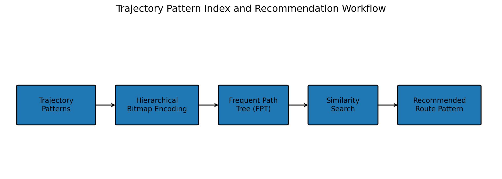
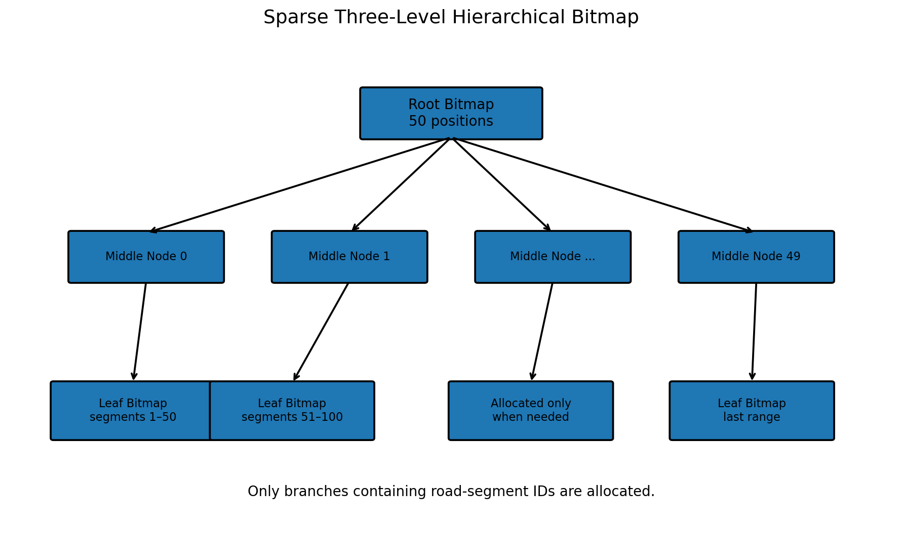
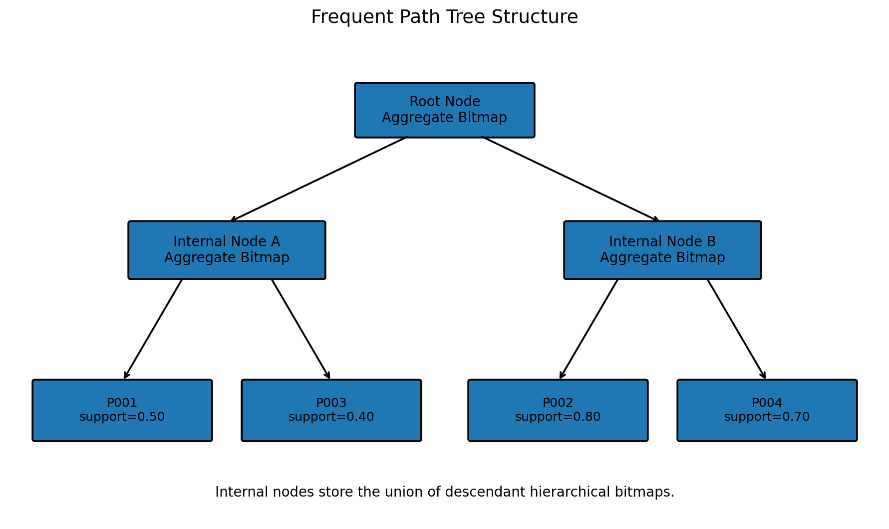
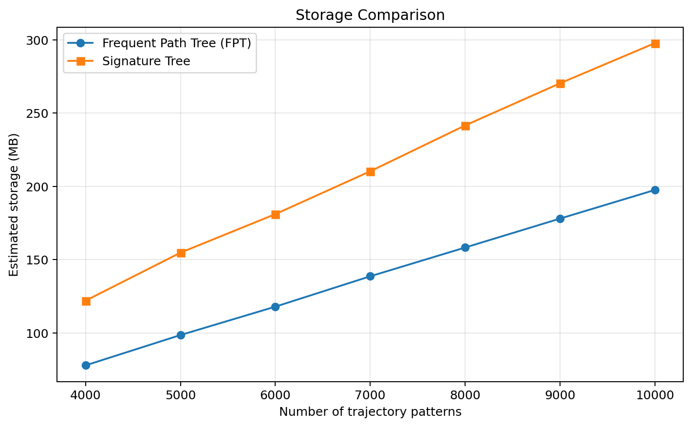
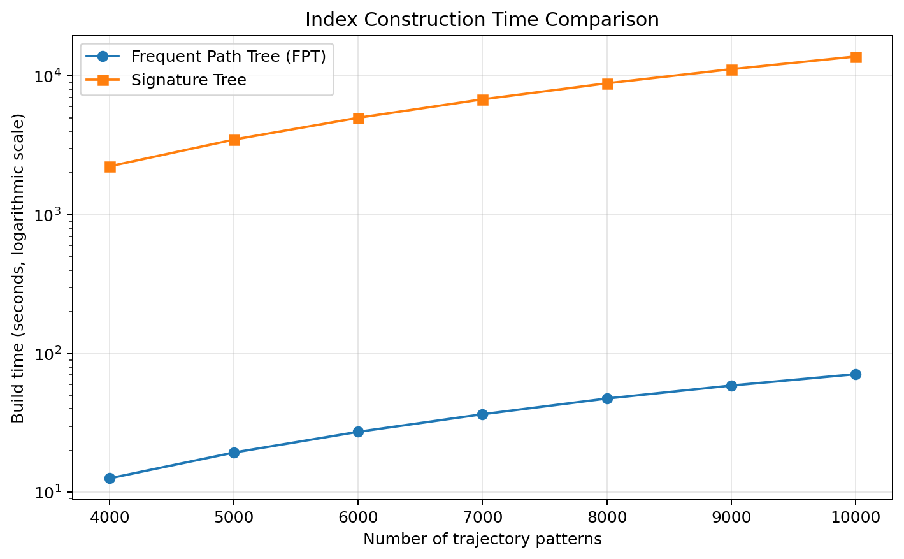
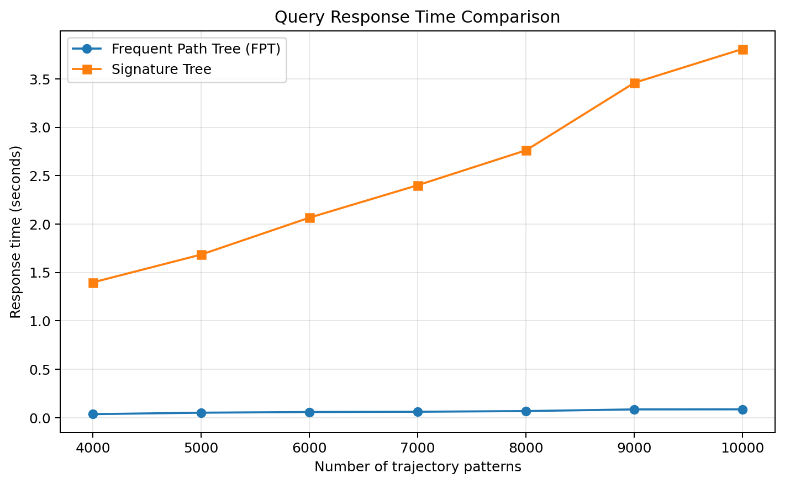

# Trajectory Pattern Index Tree for Route Recommendation

A C++ portfolio project based on my undergraduate thesis, implementing a **Frequent Path Tree (FPT)** with sparse hierarchical bitmaps for trajectory-pattern indexing and recommendation.

## 概要

本プロジェクトは、移動軌跡パターンを効率的に保存・検索するための C++ アルゴリズム実装です。

従来の Signature Tree で使用される固定長ビットマップを、必要な部分だけを生成する三層階層ビットマップに置き換え、Frequent Path Tree（FPT）を構築しました。

検索軌跡と類似する軌跡パターンを抽出し、類似度と支持度に基づいて推薦結果を返します。

## Project Background

This project originated from my individual undergraduate thesis in Computer Science and Technology at Beijing University of Technology.

The objective was to reduce the storage and query costs of large trajectory-pattern collections by replacing dense fixed-length bitmaps with sparse hierarchical bitmaps.

The original academic prototype was later reorganized into this reproducible, cross-platform C++17 portfolio project.

## Technologies

- C++17
- CMake
- Data Structures and Algorithms
- Tree-based Indexing
- Hierarchical Bitmap
- Signature Tree
- Trajectory Similarity Search
- Performance Evaluation
- Python and Matplotlib for result visualization

## My Role

This was an individual undergraduate thesis project. I was responsible for:

- researching trajectory-pattern indexing methods;
- implementing the Signature Tree baseline in C++;
- designing and implementing the three-level hierarchical bitmap;
- integrating the bitmap structure into the Frequent Path Tree;
- implementing tree insertion and recursive node splitting;
- implementing trajectory-pattern similarity search;
- applying support values as a tie-breaking rule;
- generating simulated trajectory data;
- comparing storage, construction time, and query response time;
- analyzing the experimental results and writing the thesis;
- modernizing the original Visual Studio prototype into a C++17 and CMake project.

## Technical Overview

Large collections of trajectory patterns can require substantial storage and query time when every pattern is represented by a full fixed-length bitmap.

This project replaces the dense bitmap used in a traditional Signature Tree with a sparse hierarchical bitmap. Only branches containing road-segment IDs are allocated.

The resulting Frequent Path Tree supports:

- compact storage of sparse trajectory patterns;
- hierarchical indexing and node splitting;
- similarity-based trajectory-pattern search;
- support-based tie breaking;
- comparison with a dense Signature Tree baseline.



## Core Idea

A road-segment ID belongs to a universe of 125,000 possible values:

```text
50 × 50 × 50 = 125,000
```

Instead of allocating all 125,000 bits for every trajectory pattern, the hierarchical bitmap divides the ID into three levels:

```text
road_segment_id
    ↓
root index
    ↓
middle index
    ↓
leaf index
```

Only the required middle and leaf nodes are created.



The hierarchical bitmap is then used inside the Frequent Path Tree.

Internal nodes store the union of the hierarchical bitmaps contained in their descendant nodes. During a query, branches with no overlap with the query trajectory can be skipped.



## Repository Structure

```text
trajectory-pattern-index-tree/
├── CMakeLists.txt
├── README.md
├── figures/
│   ├── build_time_comparison.png
│   ├── fpt_structure.png
│   ├── hierarchical_bitmap.png
│   ├── response_time_comparison.png
│   ├── storage_comparison.png
│   └── system_overview.png
├── results/
│   ├── demo_output.txt
│   └── thesis_benchmark.csv
├── sample_data/
│   ├── query_trajectory.csv
│   └── trajectory_patterns.csv
└── src/
    ├── frequent_path_tree.hpp
    ├── hierarchical_bitmap.hpp
    ├── main.cpp
    ├── route_recommender.hpp
    ├── signature_tree.hpp
    └── trajectory_pattern.hpp
```

## Main Components

### `hierarchical_bitmap.hpp`

Implements a sparse three-level bitmap for road-segment IDs.

Main operations:

- insert a road-segment ID;
- test whether an ID exists;
- compute the intersection between two bitmaps;
- compute the union of two bitmaps;
- estimate the bitmap storage used by allocated nodes.

### `frequent_path_tree.hpp`

Implements the Frequent Path Tree.

Main operations:

- insert trajectory patterns;
- choose an appropriate child node;
- split overflowing nodes;
- rebuild aggregate bitmaps;
- prune unrelated branches during search;
- return the best matching trajectory pattern.

### `signature_tree.hpp`

Implements a baseline Signature Tree using a dense 125,000-bit bitmap.

It uses the same tree construction and recommendation interface as the FPT, allowing the two indexing methods to be compared under the same demo conditions.

### `route_recommender.hpp`

Calculates weighted query coverage.

Later positions in the query receive larger weights:

```text
1, 10, 100, 1000, ...
```

The candidate with the highest similarity is selected. When two candidates have the same similarity, the one with the higher support value is preferred.

## Sample Data

`sample_data/trajectory_patterns.csv`

```csv
pattern_id,support,road_segments
P001,0.50,2 3 9 25 60
P002,0.80,3 5 9 23 61
P003,0.40,2 3 23 30 60
P004,0.70,2 3 9 60
```

`sample_data/query_trajectory.csv`

```csv
query_id,road_segments
Q001,2 5 9 60
```

For this query, both indexes recommend `P004`.

## Build and Run

### Requirements

- C++17-compatible compiler
- CMake 3.16 or later

### Linux or macOS

```bash
cmake -S . -B build
cmake --build build
./build/trajectory_demo
```

### Windows with CMake

```powershell
cmake -S . -B build
cmake --build build --config Release
.\build\Release\trajectory_demo.exe
```

Custom input files can also be supplied:

```bash
./build/trajectory_demo \
    path/to/trajectory_patterns.csv \
    path/to/query_trajectory.csv
```

## Demo Output

```text
Trajectory Pattern Index Demo
=============================
Loaded patterns: 4
Query Q001: 2 5 9 60

FPT recommendation: P004 | similarity=0.9910 | support=0.70 | route=2 3 9 60
Signature Tree recommendation: P004 | similarity=0.9910 | support=0.70 | route=2 3 9 60

Index summary
-------------
FPT nodes/depth: 3/2
Signature Tree nodes/depth: 3/2
FPT estimated bitmap bytes: 224
Signature Tree estimated bitmap bytes: 109424

All checks passed.
```

Execution time varies by machine, so the precise microsecond values are stored only as an example in `results/demo_output.txt`.

## Thesis Benchmark Results

The following results were reported in the original undergraduate thesis using simulated trajectory-pattern data.

They are preserved separately from the small reproducible demo in this repository.

### Storage

At 10,000 trajectory patterns:

| Index | Reported storage |
|---|---:|
| Frequent Path Tree | 202,294 KB |
| Signature Tree | 304,962 KB |



### Index Construction Time

At 10,000 trajectory patterns:

| Index | Reported construction time |
|---|---:|
| Frequent Path Tree | 70.99 seconds |
| Signature Tree | 13,783.93 seconds |

The vertical axis uses a logarithmic scale because of the large difference between the two methods.



### Query Response Time

At 10,000 trajectory patterns:

| Index | Reported response time |
|---|---:|
| Frequent Path Tree | 0.085 seconds |
| Signature Tree | 3.809 seconds |



The complete values for 4,000–10,000 patterns are available in:

```text
results/thesis_benchmark.csv
```

## Results and Skills Demonstrated

Through this project, I demonstrated the ability to:

- translate an indexing problem into custom C++ data structures;
- implement tree insertion and recursive node splitting;
- use sparse representations to reduce bitmap storage overhead;
- implement comparable FPT and Signature Tree interfaces;
- design reproducible sample input and output;
- evaluate storage, construction time, and query response time;
- distinguish newly reproduced demo results from original thesis results;
- explain an academic algorithm as an engineering portfolio project.

## Improvements over the Original Academic Prototype

The original thesis prototype was developed with Visual Studio and placed most of the implementation in a small number of header files.

This repository reorganizes the project for portfolio use:

- modern C++17 interfaces;
- cross-platform CMake build;
- descriptive file and class names;
- deterministic sample input;
- separate FPT and Signature Tree implementations;
- automatic consistency checks;
- removal of Windows-only monitoring code;
- removal of the original infinite waiting loop;
- clearer separation between demo results and thesis results.

## Scope and Limitations

This repository recommends the most similar **complete trajectory pattern** from an indexed pattern collection.

It does not:

- connect road segments to a real geographic map;
- calculate the shortest route;
- predict traffic conditions;
- directly predict only the next road segment;
- reproduce the full thesis-scale benchmark automatically.

The included CSV files are small synthetic examples designed to demonstrate the indexing and recommendation workflow.


## Academic Background

- **Project type:** Individual undergraduate thesis
- **Field:** Computer Science and Technology
- **University:** Beijing University of Technology
- **Original environment:** C++ and Visual Studio
- **Portfolio version:** C++17 and CMake

The research focused on reducing the storage and query costs of large trajectory-pattern collections by combining a Signature Tree-style index with sparse hierarchical bitmaps.
